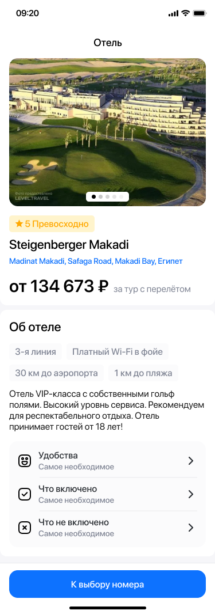
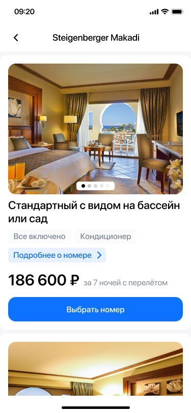

# Название вашего Hotel Application

## Содержание

- [Используемые библиотеки](#используемые-библиотеки)
- [Архитектура](#архитектура)

## Используемые библиотеки

- [cupertino_icons](https://pub.dev/packages/cupertino_icons) - Иконки для iOS.
- [go_router](https://pub.dev/packages/go_router) - Маршрутизация.
- [flutter_svg](https://pub.dev/packages/flutter_svg) - Работа с SVG.
- [mask_text_input_formatter](https://pub.dev/packages/mask_text_input_formatter) - Ввод с маской.
- [flutter_bloc](https://pub.dev/packages/flutter_bloc) - Реализация BLoC-архитектуры.
- [dartz](https://pub.dev/packages/dartz) - Функциональное программирование в Dart.
- [dio](https://pub.dev/packages/dio) - HTTP-клиент.
- [get_it](https://pub.dev/packages/get_it) - Service Locator.
- [freezed](https://pub.dev/packages/freezed) - Генерация кода для аннотаций.
- [json_serializable](https://pub.dev/packages/json_serializable) - Сериализация/десериализация JSON.
- [json_annotation](https://pub.dev/packages/json_annotation) - Генерация JSON-кода для аннотаций.
- [freezed_annotation](https://pub.dev/packages/freezed_annotation) - Аннотации для freezed.
- [pretty_dio_logger](https://pub.dev/packages/pretty_dio_logger) - Красивый логгер для Dio.
- [flutter_lints](https://pub.dev/packages/flutter_lints) - Линтинг для проектов Flutter.
- [build_runner](https://pub.dev/packages/build_runner) - Построение кода во время выполнения.

## Архитектура

Проект реализован с использованием чистой архитектуры и разделен на три основных слоя:

- **domain**: Содержит бизнес-логику и интерфейсы репозиториев.
- **data**: Реализации репозиториев и слои для работы с данными (сеть, база данных).
- **presentation**: Интерфейс пользователя, экраны, виджеты и BLoC.

## Примеры использования

\n
\n
\n
\n
